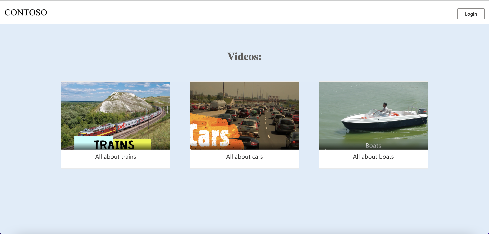
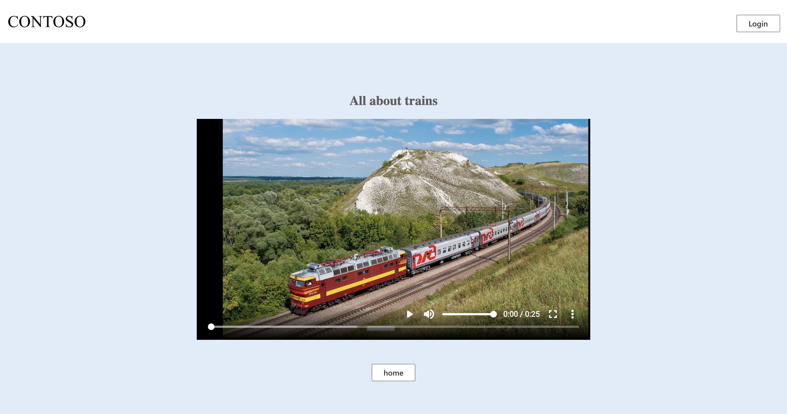

#  Simple Video Streaming Webapp with React

This sample contains a React application for streaming videos hosted in Azure Media Services. In this version anyone can browse and watch a selection of videos with no authentication needed.

## Features
#
* Web application for browsing
* Video playback using Shaka Player
(More info on the Shaka Player can be found [here](https://shaka-player-demo.appspot.com/docs/api/tutorial-welcome.html))

## Getting Started
#
### Prerequisites
1. Download and install [Visual Studio Code](https://code.visualstudio.com/Download)
2. Install [Node.js](https://nodejs.org/en/download/) LTS (v16.15)
3. Download and install [TypeScript](https://www.typescriptlang.org/download)

### Install TypeScript via npm

You can use npm to install TypeScript globally, this means you can use the tsc command anywhere in your terminal.

To do this, run ```npm install -g typescript```. This will install the latest version.

### Running the sample

1. Clone the repository
2. Upload videos using the Azure portal to your Media Services account
3. Optionally encode your videos
4. Start the default streaming endpoint
5. Publish your videos by creating a streaming locator
6. Copy the streaming locators for your videos into the videos.json file as the "locator"
7. Update the "title" and "thumbnail" for your videos, and set a unqiue "id" for each video
8. Run `npm install` to install all required npm packages for the sample
9. Run `npm start` to start the app in development mode and Open [http://localhost:3000](http://localhost:3000) to view it in the browser

#
## Browsing page

## Video viewing page


## Additional Resources
#
* [Azure Media Services Docs](https://docs.microsoft.com/azure/media-services/latest/)
* [React Docs](https://reactjs.org/docs/getting-started.html)
* [Shaka Player Docs](https://shaka-player-demo.appspot.com/docs/api/tutorial-welcome.html)